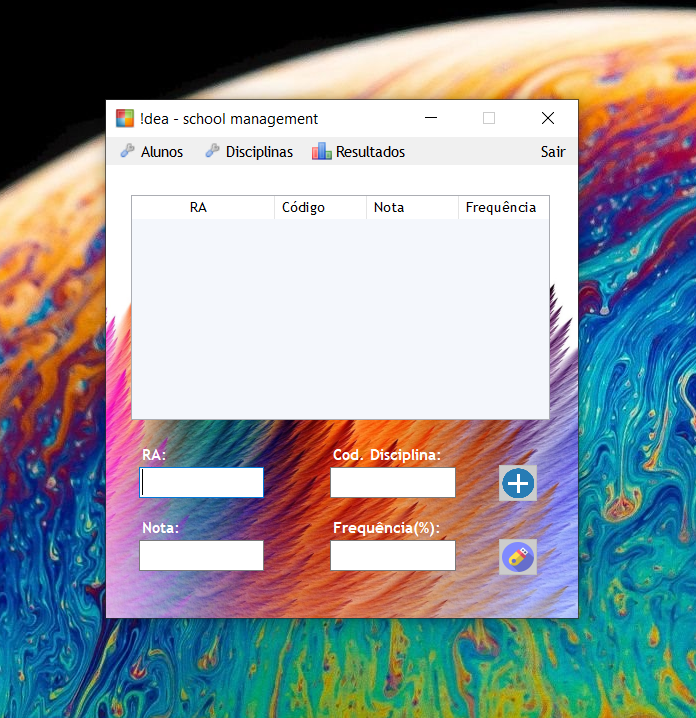
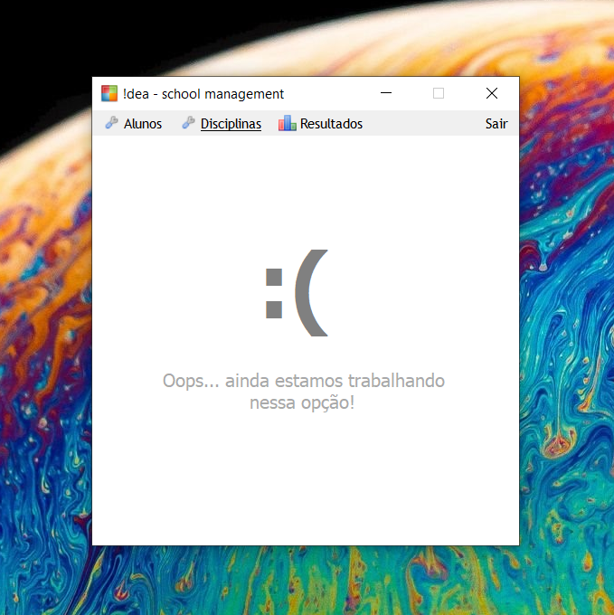

# 📚 School-management-app 📚
### Feito por Rodrigo Smith e Eduardo Migueis, em C# e NodeJS

Um aplicativo para cadastro de um resultado que um aluno teve em determinada disciplina. Foi feito com o objetivo de colocarmos em prática conhecimentos de Estrutura de Dados.

## 🔵 Mais sobre... 🔵
Este aplicativo utiliza as estruturas de dados Fila e Lista Ligada. Suas funcionalidades são simples, porém sua lógica é muito estruturada e bem pensada. Pensamos em uma empresa (!dea - school management), que administraria os dados de alunos das escolas. Dessa forma, desenvolvemos um aplicativo para ela.

## 💽 Fila e Lista Ligada 💽
Farei um pequeno resumo dessas duas estruturas, relacionando-o com seus usos em nosso projeto.

##### Fila:
Uma Fila consiste em uma classe que armazena dados (comumente, em uma matriz unidimensional), mas seguindo o princípio FIFO (First in, First out). Isso significa que, ao ser adicionado dados no vetor, apenas conseguiremos remover os primeiros que foram adicionados, assim como em uma fila de supermercado: o primeiro que chega é o primeiro que sai.
                                                
                                           FIM DA FILA        INICIO DA FILA
                    DADOS SENDO ADICIONADOS ->  🟥🟩🟩🟩🟩🟩🟩🟩🟩  <- DADOS SENDO REMOVIDOS
                                                
                                                🟩🟥🟩🟩🟩🟩🟩🟩🟩

                                                🟩🟩🟥🟩🟩🟩🟩🟩🟩
                                                
                                                        (...)

                                                🟩🟩🟩🟩🟩🟩🟩🟩🟥

##### Lista Ligada:
Uma Lista Ligada, na prática, funciona exatamente como um vetor. Sua diferença está no armazenamento físico dos dados na memória RAM. Enquanto um vetor, ao ser declarado, separa uma região inteira da memória para ser possivelmente utilizada futuramente, uma Lista Ligada procura automaticamente por qualquer local disponível para alojar os dados, **conforme eles são adicionados!**

                                                        VETOR
                                                          
     🟥 - DADOS ADICIONADOS                  🟧🟩🟩🟩🟩🟩🟩🟩🟩🟩🟦  <- DECLARAÇÃO DE UM VETOR DE 9 ESPAÇOS
     🟩 - ESPAÇO VAZIO NO VETOR
     🟦 - OUTROS DADOS QUAISQUER             🟧🟥🟥🟥🟥🟥🟥🟩🟩🟩🟦  <- DADOS ADICIONADOS
     🟧 - ESPAÇO VAZIO NA MEMÓRIA                                            
                                                
                                                     LISTA LIGADA
                                                
                                             🟦🟧🟦🟧🟦🟧🟦🟧🟧🟧🟦 
                                             
                                             🟦🟥🟦🟧🟦🟧🟦🟧🟧🟧🟦 <- ADICIONANDO UM DADO...
                                             
                                             🟦🟥🟦🟥🟦🟧🟦🟧🟧🟧🟦 <- ADICIONANDO MAIS UM...
                                             
                                             
No nosso aplicativo, utilizamos uma Fila (explicarei o porquê futuramente), mas ao invés de seu armazenamento ser dado por um vetor, é dado por uma Lista Ligada. Assim, conseguimos extrair as limitações da Fila (que é de nosso interesse, nesse caso), assim como a otimização da Lista Ligada.

## 🎨 Interface 🎨
O aplicativo foi feito em Windows Forms. Há uma breve tela de carregamento (sua intenção é apenas decorar, afinal o aplicativo é muito simples e não há necessidade de pré-carregar alguma coisa.). No momento que a tela de carregamento desaparece e a tela principal abre, é feito um teste de conexão com a API. Caso o aplicativo não esteja se comunicando com ela da forma como deveria, o programa para de ser executado e um aviso é lançado ao usuário. Segue 3 printscreens, das telas do programa. <br>  

|  |  |  | 
|----------|:----------:|----------:|
                                                                           
<br>Na primeira foto podemos ver a tela de carregamento. Na segunda, a área de cadastro de novos resultados. Na última, uma área do aplicativo sem atribuição.
Nós fizemos uma animação, utilizando um Timer, para que quando o usuário alternasse entre as telas, o painel contendo o texto "Oops..." desça e suba suavemente.

## ❓ Como usar ❓

<p> Antes de dar mais detalhes de como o programa funciona por dentro, vou mostrar como utilizá-lo. </p>

Primeiramente, em seu banco de dados, crie as seguintes tabelas (a seguinte sintaxe está no padrão do MSSQL):

```{r}
CREATE TABLE Alunos (			
RA SMALLINT PRIMARY KEY,		
Nome VARCHAR(40) NOT NULL)		

CREATE TABLE Disciplinas (
Cod INT PRIMARY KEY,
Nome VARCHAR(40) NOT NULL)

CREATE TABLE Resultados (
RA SMALLINT,
Cod INT,
Nota FLOAT NOT NULL,
Frequencia FLOAT NOT NULL,
PRIMARY KEY (RA,Cod),
FOREIGN KEY (RA)
REFERENCES AlunosED(RA),	
FOREIGN KEY (Cod)							
REFERENCES Disciplinas(Cod))

CREATE TABLE Matriculas (		
RA SMALLINT,					
Cod INT,						
PRIMARY KEY (RA,Cod),			
FOREIGN KEY (RA)				
REFERENCES AlunosED(RA),		
FOREIGN KEY (Cod)				
REFERENCES Disciplinas(Cod))	
```
Feito isso, baixe os arquivos do projeto, e no arquivo db.config.js, localizado em "/Node-Rest-API/app/config/", coloque as informações do seu banco de dados nos locais indicados. 

```{r}
module.exports = {
    user: 'SEU USUÁRIO',
  password: 'SUA SENHA',
  server: 'SERVIDOR',
  database: 'NOME DO BANCO DE DADOS',
  "options": {
    "encrypt": false,
    "enableArithAbort": true
    }
};
```
Após isso, abra a pasta "Node-Rest-API" em algum terminal (seja no cmd, no Visual Studio Code...) e execute a API com o seguinte comando (o NodeJS deve estar instalado em sua máquina. Faça o download em https://nodejs.org/en/download/):

```{r}
node server
```
Caso surja um alerta dizendo que algum pacote não foi encontrado, digite o seguinte comando, espere o carregamento concluir e redigite o comando acima.

```{r}
npm install
```
<p>Pronto! O servidor está sendo executado na sua porta 4000. Depois disso, você pode abrir o programa (um atalho dele encontra-se na pasta principal).</p>

Digite o RA de um aluno, o código de uma disciplina, a nota e a frequência. (Nota-se que o aluno, a disciplina e a matrícula de tal aluno em tal disciplina deve estar previamente adicionada no banco de dados, por meio de comandos SQL. Afinal, apenas o cadastro de um **RESULTADO** está implementado. Também nota-se a riqueza de verificações do programa e da API, que não deixará incluir um aluno não existente, uma disciplina não existente, uma matrícula não existente, um resultado já existente...). Então, aperte ➕. Depois de adicionar todos os resultados, aperte salvar 💾. Caso você queira apagar um registro da lista, selecione a linha correspondente da tabela e aperte **DELETE**. Ao pressionar salvar, todos os dados serão enviados ao servidor, que adicionará ao banco de dados.

## ❔ Como funciona ❔

<p>No momento em que apertamos o botão ➕, um resultado é adicionado na Fila (que os armazena em uma Lista Ligada). Quando adicionamos outro resultado, mais um dado entra para a Fila, assim por diante. Quando apertarmos 💾, é feita uma solicitação do tipo POST para a API para cada dado que tem na Fila. Assim, em ordem, todos os resultados são adicionados no banco de dados.</p>

<p>A API é feita no Framework NodeJS e conta com um CRUD completo com todas as tabelas usadas neste projeto, assim como diversas verificações.</p>

That is all!
